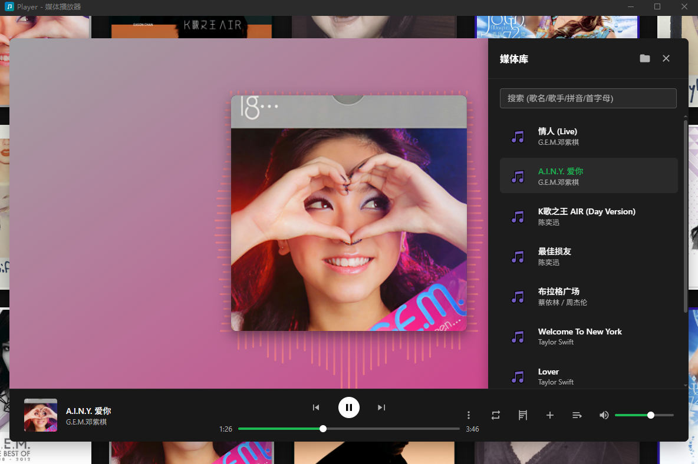
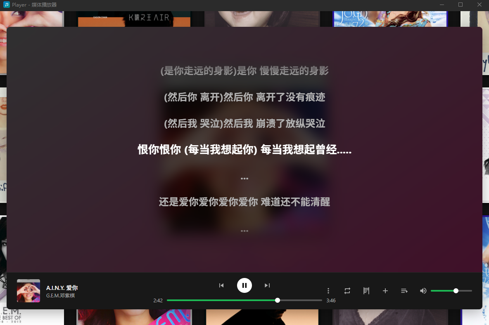
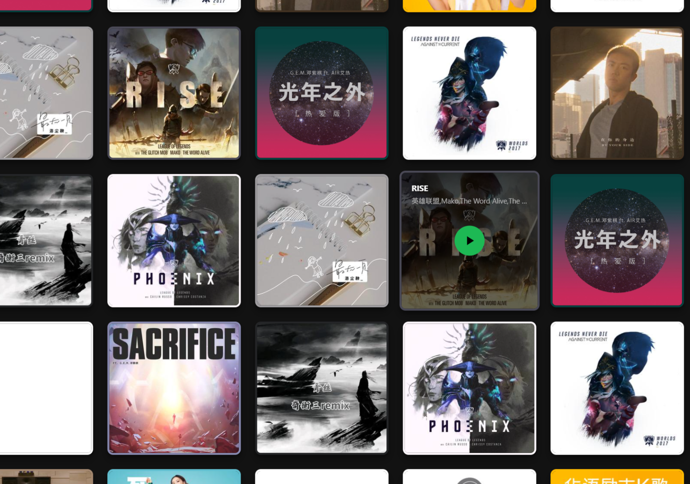
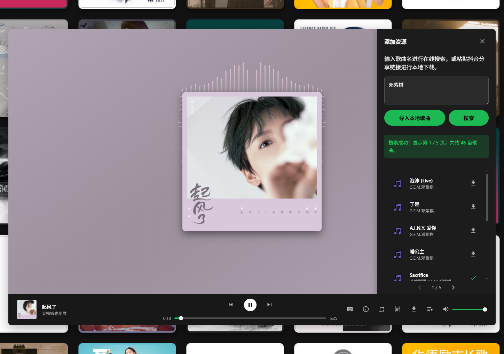

# Player - 一款功能强大的现代化媒体播放器

**Player** 是一款使用 Electron 和 Vite 构建的跨平台媒体播放器，旨在提供一个集本地播放、在线搜索与下载、以及丰富视觉体验于一体的现代化解决方案。其界面设计灵感来源于 Spotify，注重美观与用户体验。

---

## 📸 预览

<table>
  <tr>
    <td align="center"><b>主播放界面 (音频)</b></td>
    <td align="center"><b>同步歌词 & 快捷键设置</b></td>
  </tr>
  <tr>
    <td></td>
    <td></td>
  </tr>
  <tr>
    <td align="center"><b>无限画廊背景</b></td>
    <td align="center"><b>在线搜索与本地导入</b></td>
  </tr>
  <tr>
    <td></td>
    <td></td>
  </tr>
</table>

## ✨ 核心特性

**▶️ 核心播放功能**
- **多媒体支持**: 同时支持本地音频与视频文件播放。
- **播放列表管理**: 直观的播放列表，支持搜索（拼音/首字母）、删除和排序。
- **多种播放模式**: 提供列表循环、单曲循环和随机播放模式。
- **可自定义快捷键**: 支持用户自定义全局快捷键，提升操作效率。
- **状态持久化**: 自动保存播放进度、音量、播放模式等状态，下次打开时无缝衔接。

**🎨 丰富的视觉体验**
- **现代化UI**: 灵感源于 Spotify 的现代化、美观且用户友好的界面设计。
- **动态渐变背景**: 自动从歌曲封面或视频帧中提取颜色，生成流畅的动态渐变背景。
- **音频可视化**: 在播放音频时，专辑封面周围会产生与音乐节奏同步的动态光效。
- **无限画廊**: 在播放器外的空白区域拖拽，即可在无限滚动的专辑封面画廊中漫游，点击封面直接播放。
- **故障艺术效果**: 切换歌曲时触发平滑的“Glitch”视觉特效，增加动态感。

**🎵 内容管理与获取**
- **在线音乐搜索**: 内置在线音乐搜索引擎，支持分页浏览和结果缓存，提升二次搜索速度。
- **一键缓存**: 搜索到的在线歌曲可一键下载到本地媒体库，包括歌曲、封面和歌词。
- **本地媒体库导入**: 强大的本地文件夹导入功能，可递归扫描指定目录，智能匹配同名的音频、封面和歌词文件，并将其复制到应用媒体库中。
- **抖音链接解析**: （实验性功能）支持粘贴抖音分享链接，下载无水印视频或背景音乐。

**🎤 歌词与交互**
- **LRC歌词同步**: 完美支持 `.lrc` 格式的歌词文件，并实现逐行高亮同步滚动。
- **歌词拖拽定位**: 支持在歌词界面拖拽歌词，快速定位到歌曲的任意时间点。
- **新功能引导**: 首次启动时提供交互式功能导览，帮助用户快速熟悉核心功能。

## 🛠️ 技术栈

- **桌面端框架**: [Electron](https://www.electronjs.org/)
- **构建工具**: [Vite](https://vitejs.dev/) + [Electron Forge](https://www.electronforge.io/)
- **前端**: HTML5, CSS3, Vanilla JavaScript (ESM)
- **后端 (Main Process)**: Node.js
- **核心库**:
    - `axios`: 用于处理网络请求。
    - `pinyin-pro`: 为播放列表和搜索提供强大的中文拼音支持。
    - `colorthief`: 用于从专辑封面提取主题色（在预处理脚本中使用）。
- **特色实现**:
    - **自定义协议 (`media://`)**: 安全地从应用 `userData` 目录提供本地媒体文件。
    - **IPC通信**: 使用 `contextBridge` 在主进程和渲染进程之间安全通信。
    - **插件系统**: 具备加载外部JS插件的能力，用于扩展在线音乐源的解析。
    - **自动化预处理**: 使用 `ffmpeg` 和 `aubiotrack` (通过`beat-processor.js`脚本) 预先分析音频节拍，实现更精准的视觉效果。

## 🚀 开始使用

### 安装
您可以从项目的 [Releases](https://github.com/git-hub-cc/Player/releases) 页面下载适用于您操作系统的最新版本。
- **Windows**: 下载 `.exe` 安装程序。

### 导入您的音乐
1.  点击右下角的 **“添加资源”** 图标（下载箭头）。
2.  在弹出的面板中，点击 **“导入本地歌曲”** 按钮。
3.  选择包含您音乐文件的文件夹。播放器将自动扫描并导入支持的媒体。

## 👨‍💻 开发与构建

### 环境要求
- [Node.js](https://nodejs.org/) (建议 v16 或更高版本)
- `npm` 或 `yarn`

### 步骤
1.  **克隆仓库**
    ```bash
    git clone https://github.com/git-hub-cc/Player.git
    cd Player
    ```

2.  **安装依赖**
    ```bash
    npm install
    ```

3.  **运行开发环境**
    此命令将启动 Vite 开发服务器和 Electron 应用，并支持热重载。
    ```bash
    npm start
    ```

4.  **构建可执行文件**
    此命令将根据您的操作系统，使用 Electron Forge 构建最终的可执行文件和安装包，输出到 `out` 目录。
    ```bash
    npm run make
    ```

## 📂 项目结构
```
.
├── public/                  # 渲染进程资源 (Vite根目录)
│   ├── css/                 # 样式文件
│   ├── js/                  # 渲染进程JavaScript逻辑
│   ├── assets/              # 应用图标等资源
│   └── index.html           # 主HTML文件
├── script/                  # 辅助脚本
│   └── 01beat-processor.js  # 媒体节拍与颜色预处理脚本
├── src/                     # 主进程与预加载脚本源码
│   ├── backend/             # 主进程核心后端逻辑
│   │   ├── plugins/         # 插件系统
│   │   ├── main-api.js      # IPC调用的主要实现
│   │   └── douyin-preload.js# 抖音解析的预加载脚本
│   ├── main.js              # Electron主进程入口
│   └── preload.js           # Electron预加载脚本
├── forge.config.js          # Electron Forge 配置文件
└── package.json             # 项目依赖与脚本
```
## 🙏 致谢 (Acknowledgements)

### 数据源致谢
本项目的部分在线音乐搜索与解析功能使用了 **GD音乐台 (music.gdstudio.xyz)** 提供的 API。
*   请注明出处：“GD音乐台 (music.gdstudio.xyz)”。
*   请尊重作者劳动成果。
*   使用过程如遇问题可 B 站私信：**GD-Studio**。

## ⚠️ 免责声明 (Disclaimer)

**本站资源来自网络，仅限本人学习参考，严禁下载、传播或商用，如侵权请与我联系删除。继续使用将视为同意本声明。**

本项目中使用的所有媒体资源（包括但不限于音频和视频文件）均收集自互联网，仅供学习和技术演示使用。

## 📜 许可证
本项目采用 [MIT](./LICENSE) 许可证。

## 声明
本项目中使用的所有在线媒体资源均收集自互联网，仅供学习和技术演示使用，不作任何商业用途。所有媒体内容的版权归原作者或其各自的版权所有者所有。